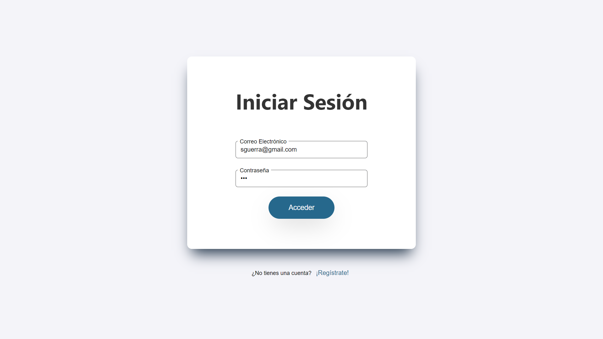
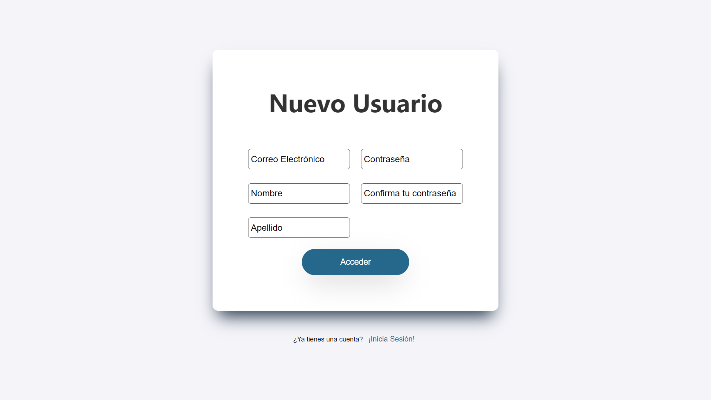
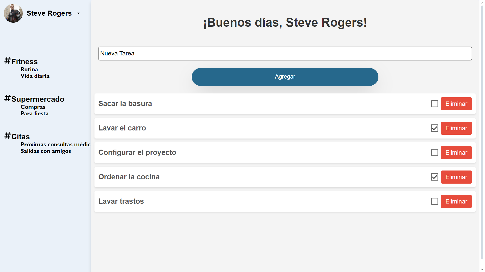

# ToDoList
Aplicación que pretende organizar de forma atractiva las tareas a realizar de un usuario. Se divide en dos partes principales.

## Backend
REST API construida en PHP con el framework symfony. Se utilizó API Platform para el manejo de las rutas, así como lexik_jwt_authentication para el manejo de credenciales.

En cuanto a la base de datos, se creo un volumen de Docker, el cual puede ser construido y accedido a través del siguiente comando:

```
docker-compose --env-file .env.local up -d
```
El archivo _.env.local_ hace referencia al archivo de configuración en el que se encuentran todas las variables de entorno necesarias para levantar el proyecto, el cual se hará llegar a través de correo electrónico.

En esta API se tomaron en cuenta 5 entidades distintas:
- Usuario
- Tarea
- Proyecto
- Sección
- Etiqueta

De manera que el usuario pueda acceder a una mayor organización si así lo desea. Se puede visualizar todas las rutas disponibles a través de la ruta

```
http://localhost:8000/api
```
Esto luego de haber ejecutado el comando.
```
symfony server:start
``` 
para levantar el servidor.

Cabe destacar que este proyecto se llevó en paralelo al frontend. Sin embargo, únicamente fue posible implementar las funcionalidades de registro e inicio de sesión.

## Frontend
En el caso del frontend, se siguió un diseño simple solamente para cumplir con los requisitos solicitados en la prueba. Construido completamente con React-Vite y utilizando SCSS para el manejo de estilos.

Como se mencionó anteriormente, tanto el inicio de sesión como el registro de una nueva cuenta están conectados completamente con el servidor, por lo que es necesario levantar el mismo y crear el volumen de docker para poder visualizar la página.

Para mayor accesibilidad, se adjuntan capturas de pantalla de la vista final.

### Inicio de sesión:


### Registro de un nuevo usuario:


# Dashboards de tareas:
